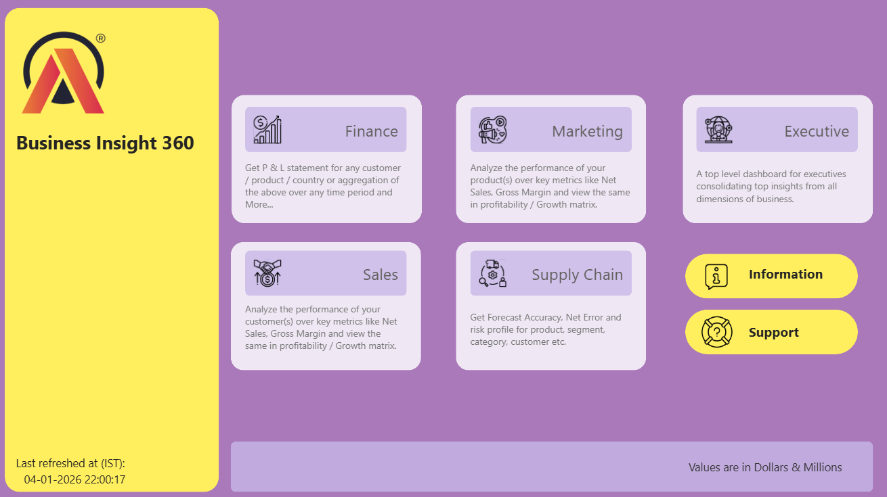

# 📊 Business Insights 360

## 🚀 Project Overview
This project focuses on building an **enterprise-level business analytics solution** to support **data-driven decision-making across global markets**. The goal was to centralize data from key business functions **Finance, Sales, Marketing, and Supply Chain** into a **single, transparent analytics layer**.

By moving beyond fragmented, Excel-based analysis, the solution delivers a **360° business insight dashboard** that enables leadership to clearly understand **performance trends, customer behavior, and growth opportunities across regions**. This unified view empowers stakeholders to make **more confident, timely, and strategic decisions** at scale.

---

## ❗ Business Problem
- Decisions driven by **surveys, intuition, and limited Excel analysis** resulted in **financial losses**
- Excel-based reporting caused **data silos**, **inconsistent metrics**, and **low transparency**
- Increasing competition from **data-mature organizations** reduced **market position and growth potential**

---

## 🎯 Objectives
- **Centralize data** to improve visibility across markets and business functions  
- Enable **data-driven decision-making** using customer and consumption insights  
- Deliver a **global analytics dashboard** to improve operational efficiency and drive approximately **10% profit growth**

---

## 🏢 Company Overview
**AltiQ Hardware** is a fast-growing company operating in the global computer hardware industry. Over recent years, the organization has expanded its footprint across multiple international markets, offering **computers and computer accessories** through three primary sales channels:
- **Retailers**
- **Direct Sales**
- **Distributors**

During its expansion into the **American market**, AltiQ Hardware encountered unexpected **financial losses**. Strategic decisions were largely driven by **surveys, intuition, and limited Excel-based analysis**, which restricted visibility into true business performance.

Meanwhile, competitors with **mature analytics capabilities** were leveraging data-driven insights to make **faster, more accurate decisions**, gaining a competitive edge. Recognizing this gap, AltiQ Hardware identified the urgent need to build a **robust analytics foundation**—one that could support **informed decision-making, improve transparency, and strengthen its competitive position** in a highly data-driven industry.

---

## 🗂️ Datasets Used
Before starting the analysis, understanding the available data was a critical step. The project uses a combination of **dimension tables**, **fact tables**, and **cost & pricing tables** to build a comprehensive analytics model.

### 📌 Dimension Tables (Static Reference Data)
- **dim_customer**  
  Contains **75 customers across 27 markets** (e.g., India, USA, Spain), operating on **Brick & Mortar** and **E-commerce** platforms, and selling through three channels: **Retailer, Direct, and Distributor**.

- **dim_market**  
  Defines the market hierarchy spanning **27 markets**, **7 sub-zones**, and **4 regions**:  
  **APAC, EU, LATAM, and North America (NA)**.

- **dim_product**  
  Represents the product structure across:
  - Divisions: **P&A, PC, N&S**
  - **14 product categories** (e.g., keyboards, internal HDDs)
  - Multiple product variants and SKUs

### 📊 Fact Tables (Transactional Data)
- **fact_sales_monthly**  
  Stores **monthly actual sales quantity** at the **customer and product level**, forming the core dataset for performance analysis.

- **fact_forecast_monthly**  
  Contains **monthly forecasted demand** used for planning and inventory optimization.  
  This table is **denormalized for analytics** and recorded at **month-start dates**.

### 💰 Cost & Pricing Tables
- **freight_cost**  
  Market-wise **logistics and freight costs** by fiscal year.

- **gross_price**  
  Product-level **gross pricing details**.

- **manufacturing_cost**  
  **Year-wise manufacturing cost** per product.

- **pre_invoice_deductions**  
  Customer-level **pre-invoice discount percentages**.

- **post_invoice_deductions**  
  Details related to **post-invoice deductions and other adjustments**.

## 📊 Report Views
The report is designed to support **Finance, Sales, Marketing, Supply Chain, and Executive** stakeholders by delivering **clear, actionable insights** that enable **faster decision-making**, **improved performance monitoring**, and **more effective strategic planning** across the organization.

<!-- GIF showcasing all report views -->

### 🔍 Available Views
- Finance View  
- Sales View  
- Marketing View  
- Supply Chain View  
- Executive View  
